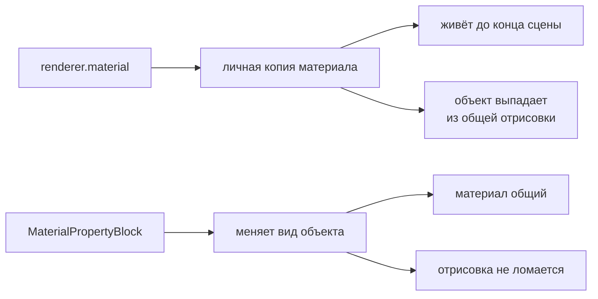

# Utils

Мелкие самостоятельные помощники, которым не нужен свой модуль. Каждый решает одну
задачу и ни о чём в проекте не знает.

| Что | Зачем |
| --- | --- |
| `PRLog` | Логирование с указанием источника |
| `MonoBehaviourUtils` | Общие операции над компонентами |
| `ResourcesUtils` | Загрузка из `Resources` по путям SDK |
| `TextureOffsetScroller` | Двигает текстуру ровно: лента, конвейер |
| `TextureWaterMotion` | Колышет текстуру: вода, лава, туман |
| `ColorizeModel` | Перекрашивает все меши объекта и возвращает исходные цвета |

## Работа с материалами

Оба визуальных помощника меняют вид объекта через `MaterialPropertyBlock`, и это
не деталь реализации, а главное в них.



Обращение к `renderer.material` создаёт объекту **личную копию** материала. Она никогда
не уничтожается и вдобавок выбивает объект из общей отрисовки. Один объект это переживёт,
но перекрашивают обычно многие — и тогда копий столько же.

`MaterialPropertyBlock` делает то же самое, ничего не создавая: он подменяет значения
свойств для конкретного объекта поверх общего материала.

## Имена свойств зависят от конвейера

В URP основная текстура называется `_BaseMap`, а цвет — `_BaseColor`. Во встроенном
конвейере это `_MainTex` и `_Color`. Поэтому имя свойства у обоих компонентов
настраивается, а значения по умолчанию взяты для URP.

Если свойства в материале нет, `TextureOffsetScroller` говорит об этом в лог и ничего
не делает: остановившуюся ленту без сообщения в логе искали бы долго.

## TextureOffsetScroller

Двигает текстуру со скоростью, заданной в инспекторе.

Смещение и масштаб лежат в шейдере одним вектором `_ST`, поэтому масштаб снимается
с материала при запуске и передаётся вместе со сдвигом — иначе текстура растянулась бы
при первом же кадре.

Накопленный сдвиг сворачивается в один период. Для текстуры сдвиг на `1` и на `1001`
выглядит одинаково, но растущее без предела число теряет точность, и через час игры
лента начинает дёргаться.

Работает в `PRUpdate`, поэтому на логической паузе останавливается вместе с игрой,
а не едет под открытым окном.

## TextureWaterMotion

То же свойство `_ST`, но движение другое: лента едет ровно, а вода дышит. Компонент
складывает три движения в один вектор.

| Что | Поля | Что делает |
| --- | --- | --- |
| Снос | `speed` | медленно тянет текстуру течением |
| Дыхание | `pulseAmplitude`, `pulsePeriod` | тайлинг расходится и сходится |
| Покачивание | `swayAmplitude`, `swayPeriod` | ведёт текстуру по небольшой петле |

Значения по умолчанию рассчитаны на спокойную воду: снос в сотые доли за секунду,
дыхание пять процентов за шесть секунд. Для лавы период увеличивают, для ручья
увеличивают снос.

Две вещи, из-за которых это выглядит водой, а не зумом:

- **Оси идут вразнобой.** Дыхание по Y сдвинуто на четверть периода относительно X,
  покачивание по осям берёт разные доли периода. Когда всё в такт, глаз читает
  наезд камеры; когда вразнобой — волну.
- **Дыхание держится середины текстуры.** Шейдер считает координату как
  `uv * scale + offset`, то есть тайлинг растёт от угла развёртки. Компонент добавляет
  к смещению поправку `0.5 * (1 - scale)`, иначе поверхность на каждом вдохе уезжала бы
  в сторону.

Нулевой период выключает своё движение: `pulsePeriod = 0` оставляет только снос
и покачивание.

Время каждого движения сворачивается в его собственный период, а снос — в один тайл.
Общий растущий счётчик через час игры теряет точность, и вода начинает дёргаться.

Работает в `PRUpdate` — на логической паузе замирает вместе с игрой.

## ColorizeModel

Красит все меши объекта разом и умеет вернуть исходные цвета.

Исходные цвета снимаются при запуске, поэтому возвращать их можно в любой момент, ничего
не запоминая на стороне вызывающего:

```csharp
colorize.SetBlack();   // неизвестная награда — чёрный силуэт
colorize.ResetColor(); // показали, что внутри
```

`Apply()` красит цветом, заданным в инспекторе; он без параметров и вешается прямо
на `UnityEvent`.

Список мешей фиксируется при запуске: добавленные позже перекрашены не будут.
Материал без нужного свойства считается белым, чтобы возврат цвета его не испортил.
