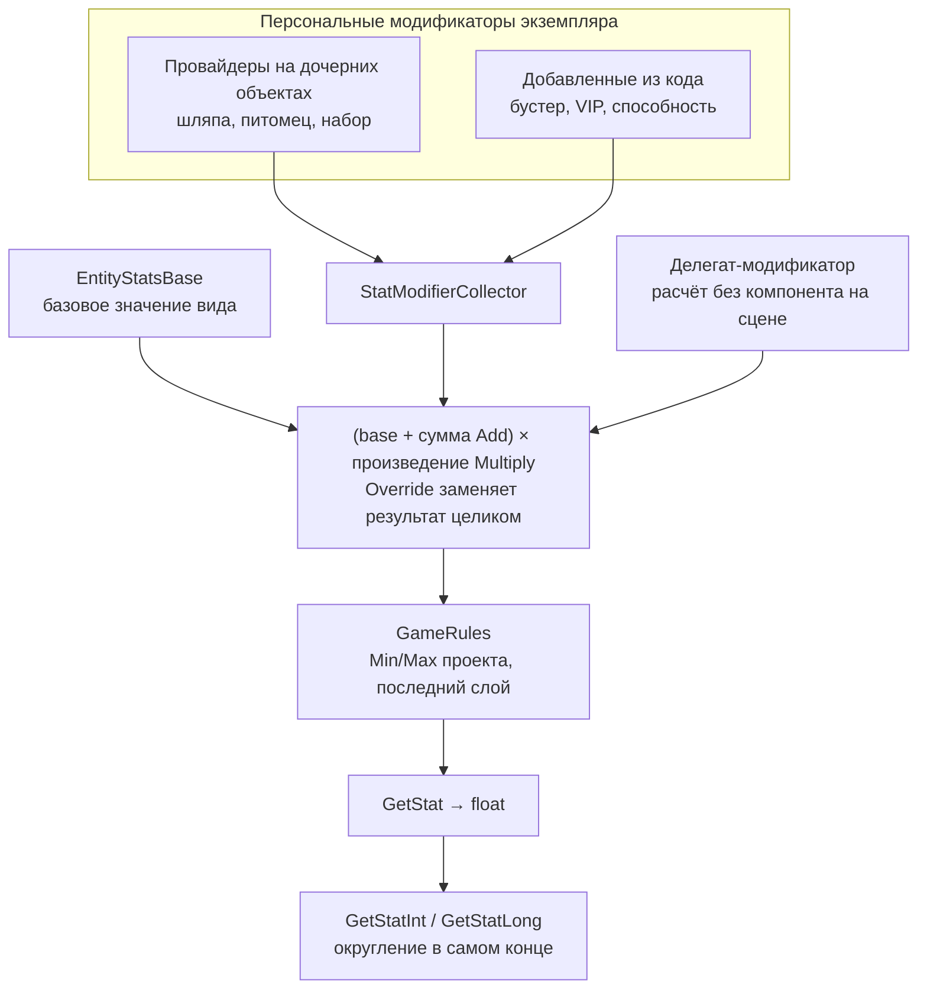

# Характеристики сущности

Скорость, сила прыжка, рост, время подката — всё, что можно выразить числом и что
меняется от экипировки, баффов и глобальных правил. Итоговое значение собирается
из трёх слоёв, и каждый слой отвечает за своё:

```text
EntityStatsBase → персональные модификаторы → GameRules → результат
   базовое           экипировка, питомцы,        границы
   значение          баффы                       проекта
```

Базовое значение принадлежит виду сущности, модификаторы — конкретному экземпляру,
правила — всему проекту. Порядок неизменен: сначала база, потом персональное, в конце
ограничения.



Правила применяются **после** модификаторов и не могут быть ими обойдены: `Override`
заменяет значение экземпляра, но не снимает границы проекта. Округление стоит ещё
дальше — после правил, а не между слоями.

## Карта модуля

| Тип | Роль |
| --- | --- |
| `EntityStatsBase<TEnum>` | ScriptableObject со словарём «ключ → базовое значение» |
| `StatModifier`, `StatModifier<TEnum>` | одно изменение одной характеристики |
| `StatModifierType` | как применять: `Add`, `Multiply`, `Override` |
| `IStatModifiersProvider`, `IStatModifierProvider` | источник модификаторов: шляпа, питомец, набор |
| `StatModifierCollector` | компонент сущности: собирает модификаторы с дочерних объектов и принимает добавленные из кода |
| `EntityStatsUtils` | расчёт итогового значения |

## Базовые значения

`EntityStatsBase<TEnum>` — ассет с таблицей характеристик. Ключи задаёт провайдер
перечислений, поэтому набор характеристик у каждого вида сущности свой:

```csharp
public class PlayerStats : EntityStatsBase<PlayerStatsEnumeration> { }
```

Ассет обычно один на вид: все игроки ссылаются на один и тот же `Player stats.asset`,
а различия между конкретными игроками дают модификаторы.

## Модификатор

```csharp
[SerializeField] private List<StatModifier<PlayerStatsEnumeration>> statModifiers;
```

| Поле | Что задаёт |
| --- | --- |
| `Property` | характеристика, на которую действует модификатор |
| `Value` | величина |
| `Type` | `Add`, `Multiply` или `Override` |
| `Priority` | у `Override` больше — сильнее; у `Add` и `Multiply` не используется |

Порядок внутри слоя фиксирован и от порядка добавления не зависит:

```text
(base + сумма всех Add) × произведение всех Multiply
```

`Override` отменяет весь расчёт и подставляет своё значение. Между несколькими
`Override` выигрывает больший `Priority`, при равенстве — добавленный последним.

Неродовой `StatModifier` — база для сериализации и общих списков; в инспекторе
и в коде используется `StatModifier<TEnum>`, который знает свой набор ключей.

## Кто даёт модификаторы

Источник — компонент **на дочернем объекте сущности**: надетая шляпа, питомец рядом,
активный набор предметов.

```csharp
public class HatDefinition : WearableDefinitionBase<HatEntity>, IStatModifiersProvider
{
    [SerializeField] private List<StatModifier<PlayerStatsEnumeration>> statModifiers;

    public IEnumerable<StatModifier> StatModifiers => statModifiers.ToList();
}
```

`IStatModifierProvider` — тот же контракт для источника с единственным модификатором.

## Сборщик

`StatModifierCollector` вешается на корень сущности рядом с `EntityLinkBase`. Он
обходит дочерние объекты, складывает найденные модификаторы в свой
`FloatPropertyContainer` и отдаёт результат по запросу.

| Когда пересобирает | Как |
| --- | --- |
| При старте сущности | `Start()` |
| При смене экипировки | `IEntityEquipmentChangedEvent` для своей сущности |
| Вручную | `CollectProviders()` — поднимает `EntityEvents.RefreshStats` |

Собираются только **активные** дочерние объекты: выключенная шляпа модификаторов
не даёт.

### Источники без объекта на сцене

Бустер, VIP-статус или способность объекта в иерархии сущности не имеют, поэтому
провайдером стать не могут. Они добавляют модификатор напрямую, назвав себя владельцем:

```csharp
var boost = new StatModifier<PlayerStatsEnumeration>(
    PlayerStatsEnumeration.WalkSpeed, 1.25f, StatModifierType.Multiply);

collector.AddModifier(this, boost);
// ...по истечении бустера
collector.RemoveModifiers(this);
```

Модификаторы владельца переживают пересборку: при смене экипировки они применяются
заново. `RemoveModifiers` снимает все модификаторы одного владельца разом. Оба метода
поднимают `EntityEvents.RefreshStats`, поэтому подписчики пересчитают характеристики
сами.

## Расчёт

```csharp
// Обычный путь: модификаторы даёт сборщик на префабе
float speed = EntityStatsUtils.GetStat(
    PlayerStatsEnumeration.WalkSpeed, Core.Stats, statCollector);

int jumps = EntityStatsUtils.GetStatInt(
    PlayerStatsEnumeration.JumpCount, Core.Stats, statCollector, 1);
```

Второй путь — передать модификаторы делегатом. Тогда стат считается без компонента
на сцене: в редакторе, в предпросмотре предмета, в тесте.

```csharp
float preview = EntityStatsUtils.GetStat(
    PlayerStatsEnumeration.WalkSpeed, stats, (stat, value) => value * 1.2f);
```

Оба пути заканчиваются одинаково — `GameRules.ApplyStatRules()`, глобальные границы
характеристики. Подробности в [GameRules](../../GameRules/README.md).

`GetStatInt` и `GetStatLong` округляют **после** всех модификаторов и правил, а не
в промежутке. Для дробных величин — времени, долей секунды, множителей — берите
`GetStat`: иначе `0.15` превратится в `0`.

## Ограничения и что стоит улучшить

- **Вся цепочка считает во `float`.** У него 24 бита мантиссы: целые числа больше
  ~16.7 млн перестают быть точными, и `GetStatLong` расширяет до `double` уже
  испорченное значение. Сейчас это не болит — все существующие характеристики
  физические: скорость, сила прыжка, рост. Заболит, когда через характеристики пойдут
  деньги или доход: очки игрока и кошелёк уже `long`, а бустеры по смыслу — множители
  добычи. Лечится переводом цепочки на `double`, который точно представляет все `long`
  до 2^53. Менять придётся и сериализованный словарь `EntityStatsBase<TEnum>`, поэтому
  безопаснее добавить новое поле, а не заменять тип у существующей коллекции.

- **Отдельные характеристики целого типа — соблазн, но не решение.** `PropertyContainer`
  уже даёт `IntPropertyContainer` и `LongPropertyContainer`, и напрашивается «целый
  стат». Но `Multiply` над целым обрубает дробную часть на каждом шаге, и «×1.5 к трём
  прыжкам» начнёт зависеть от порядка множителей. Текущее правило — считать в
  вещественном и округлить один раз в конце — честнее. Улучшение здесь не «много
  типов», а «один достаточно широкий тип».

- **Нечисловые характеристики в эту систему не ложатся.** Для «разрешён двойной
  прыжок» или «тип брони» операции `Add` и `Multiply` бессмысленны. Согласовывать
  булевы решения из нескольких источников умеет
  [FlagsSystem](../../FlagsSystem/README.md) — тянуть их в характеристики не нужно.

- **`StatModifierType` дублирует `ModifierTypes`.** Один и тот же набор
  `Add`/`Multiply`/`Override` описан дважды — как `enum` и как `Enumeration`, между
  ними switch-конвертация в сборщике. Схлопывать только с миграцией: `enum`
  сериализован на префабах и в определениях предметов.

- **Поиск характеристики линейный.** `EntityStatsBase<TEnum>.TryGet` перебирает весь
  словарь и на каждой итерации вызывает `ToEnumeration()`. Для характеристик, читаемых
  каждый кадр, это заметно — кешируйте результат.

## Смотрите также

- [Entity](../README.md) — сущности, описание, реестры и время жизни
- [PropertyContainer](../../PropertyContainer/README.md) — устройство слоя персональных модификаторов
- [GameRules](../../GameRules/README.md) — глобальные границы характеристик
- [Enumeration](../../Models/Enumeration/README.md) — ключи характеристик
