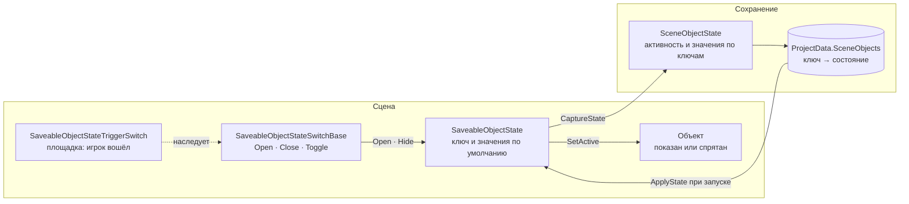
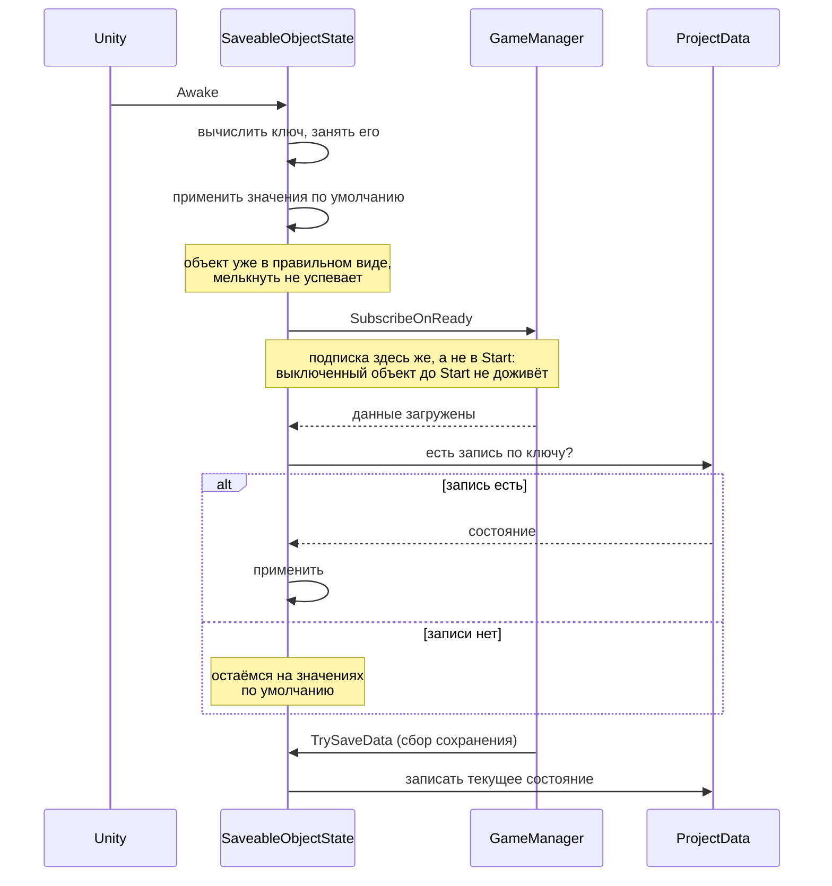
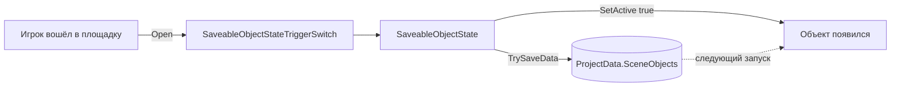

# Состояние объекта сцены

`SaveableObjectState` отвечает на один вопрос: **в каком виде объект должен появиться**.

Если о нём есть запись в сохранении — применяется она. Если записи нет — берутся
значения по умолчанию из инспектора. Новый объект на уровне ведёт себя предсказуемо,
а уже виденный игроком возвращается таким, каким тот его оставил.

Из коробки хранится активность: был объект включён или выключен. Всё остальное
добавляют наследники.

## Из чего собрано

Три компонента и одна запись в сохранении. Состояние знает, **как** хранить;
переключатель — **когда** менять; запись — **что** сохранено.



Переключатель необязателен: у состояния есть свои `Open()` и `Hide()`, и когда повод
приходит из кода или с кнопки интерфейса, зовут их напрямую.

## Как это работает во времени

Порядок здесь не деталь реализации, а суть: данные проекта в `Awake` ещё не загружены,
поэтому состояние применяется в два приёма.



Снимок снимается и при уходе объекта со сцены — это делает `PRMonoBehaviour`
в `UnRegisterEventsOnDestroy`, пока игра идёт и данные прочитаны.

## Настройки

| Поле | Что делает |
| --- | --- |
| Цель | Чьё состояние храним. Подставляется сам объект компонента, можно указать другой |
| Источник ключа | Свой идентификатор или идентификатор цели |
| Свой ключ | Только для чтения. Выдаётся при добавлении компонента, меняется кнопкой |
| Хранить активность | Выключается, если наследник хранит только своё |
| Активен по умолчанию | Каким объект появляется, когда записи о нём ещё нет |
| Взять группу из набора | Только у сущностей: считать объект не по `EntityType`, а по своей группе |
| Группа | Группа подсчёта; незаполненная означает `Common` |

Инспектор у компонента свой: он прячет поля, которые сейчас ни на что не влияют —
ключ при чужом источнике, значение активности при выключенном хранении и группу,
пока она берётся из типа сущности.

## Ключ

Ключ обязан быть **одним и тем же при каждом запуске**. Иначе сохранённое состояние
не найдётся, и объект каждый раз будет вставать в значения по умолчанию — молча,
без единой ошибки в консоли.

| Источник | Откуда берётся | Когда подходит |
| --- | --- | --- |
| `OwnId` | генерируется в редакторе, лежит в самом компоненте | по умолчанию; переживает перезапуск и переименование |
| `TargetId` | `IIdentifiable.Id` с объекта цели | объект уже опознан в игре — например держатель с заданным `Id` |

Свой ключ — обычный `Guid` в привычной записи с дефисами. Выдаётся он при добавлении
компонента и только в редакторе: сгенерированный в игре никуда не сохранится,
и при следующем запуске оказался бы другим.

**Копия объекта получает свой ключ.** Отдельного вызова «вас скопировали» в Unity нет,
но у каждого объекта сцены есть `GlobalObjectId`, и при копировании он не наследуется.
Компонент хранит рядом с ключом адрес объекта, которому ключ выдан, и узнаёт копию
по расхождению. Без этого россыпь, расставленная через Ctrl+D — а её так и расставляют, —
ехала бы с одним ключом на всех: подобрал любой предмет, исчезли все.

Тем же путём ключ меняется при переносе объекта в другую сцену: отличить перенос
от копирования нечем, и сохранённое состояние такого объекта потеряется.

Руками ключ не правится — поле показано только для чтения. Опечатка в нём не ломает
ничего заметного: состояние просто перестаёт находиться, и объект молча встаёт
в значения по умолчанию. Ошибку такого рода ищут долго, поэтому проще её не допускать.

Новый ключ выдаётся кнопкой **«Сгенерировать новый идентификатор»**, и она спрашивает подтверждение:
после смены прежнее сохранённое состояние не найдётся. Чаще всего это и нужно —
развести два объекта, которым ключ достался общим при копировании.

У `TargetId` есть цена: состояние одно на всех, у кого совпадает идентификатор.
Для нескольких одинаковых объектов это означает общую запись, поэтому им нужен `OwnId`.

Два объекта с одним ключом пишут в одну запись и перетирают друг друга — побеждает
тот, кто сохранился последним. По симптомам это ловится тяжело, поэтому совпадение
находится при старте и выводится в консоль с именами обоих.

### Почему не `GetInstanceID()`

Unity выдаёт `InstanceID` заново при каждой загрузке сцены. Как ключ сохранения он
не работает вовсе: запись, сделанная в прошлом запуске, в этом уже не найдётся.
Для сравнений внутри одного запуска он годится, для хранения — нет.

## Где стоит компонент

Выключенный объект не получает `Awake`. Значит, компонент на нём **не сможет включить
его обратно**: он просто не запустится.

Если объект может оказаться выключенным, компонент вешают на живого соседа или
родителя и указывают выключаемый объект в поле цели. Ради этого поле и существует.

Сам себя объект выключить всё же может — когда «выключен» стоит значением по умолчанию.
Ради этого случая подписка на данные делается в `Awake`, а не в `Start`: `SetActive(false)`
не прерывает начатый `Awake`, а сигнал готовности — обычный обратный вызов, не сообщение
Unity, поэтому выключенный объект его получит и сможет включиться обратно. Подпишись
компонент в `Start`, такой объект не восстановился бы никогда.

## Открыть объект в игре

Тайкун-сценарий: объект лежит на уровне выключенным, игрок нажимает кнопку или покупает
улучшение — объект появляется и остаётся на месте после перезапуска.

Собирается из двух частей:

1. На самом объекте — `SaveableObjectState` с выключенным «Активен по умолчанию».
2. На площадке рядом — `SaveableObjectStateTriggerSwitch` со ссылкой на это состояние.
   Игрок заходит в её триггер — объект появляется.

Если повод другой — кнопка интерфейса, конец обучения, покупка в магазине, — переключатель
не нужен вовсе: у самого `SaveableObjectState` есть `Open()` и `Hide()` без параметров,
и они вешаются прямо на `UnityEvent` кнопки.

### Переключатели

`SaveableObjectStateSwitchBase` — основа: ссылка на состояние, методы `Open`, `Close`
и `Toggle`, события `onOpened`/`onClosed` и защита от повторного срабатывания.
Абстрактный намеренно: переключатель без повода не нужен, а наследник отвечает
на единственный оставшийся вопрос — по какому поводу переключать.

`SaveableObjectStateTriggerSwitch` — готовый повод: вход игрока в триггер. Настраивается
действие (показать, спрятать, переключить) и нужен ли именно игрок; правило «кому
разрешено» сужается переопределением `CanActivate`. Коллайдер должен быть отмечен
`Is Trigger` — без галки площадка молча становится препятствием, поэтому компонент
проверяет это при старте.



Переключение сразу пишется на диск. Ждать общего сбора сохранения нельзя: между
покупкой и сбором игра может закрыться, и игрок увидит, что купленное пропало.

### Где вешать переключатель

Обычное место — **не тот объект, которым он управляет**: кнопка, площадка покупки или
триггер, а ссылка ведёт на состояние открываемого объекта. Так переключатель остаётся
доступен, когда управляемый объект спрятан.

Управлять состоянием на своём же объекте тоже можно — просто укажите его в ссылке.
Ограничение здесь одно, и оно физическое: спрятав объект, внутри которого сидишь,
выключаешься вместе с ним, и показать его обратно сможет только кто-то снаружи.
Для объекта, который только открывают, это не мешает.

Проверяется не совпадение объектов, а вложенность: выключение цели гасит и её потомков,
поэтому переключатель на дочернем объекте попадает в ту же ловушку. Такая расстановка
находится при старте и выводит предупреждение — это подсказка, а не запрет.

### Покупка

Цену переключатель не знает намеренно: списание ресурсов — отдельная забота, и в проекте
для неё уже есть `ResourceManager.TrySpendResource`. Покупающий компонент списывает
ресурс и, если списание прошло, зовёт `Open()`:

```csharp
if (PRUnitySDK.Managers.Resource.TrySpendResource(price, amount, requiredSave: true))
    stateSwitch.Open();
```

## Своё состояние

Наследник переопределяет три метода. Ключ значения — `EnumerationType<T>`: он несёт
и имя, и тип, поэтому значение читается и пишется как есть, без разбора строк.

```csharp
public static class DoorStateKeys
{
    public static readonly EnumerationType<bool> Opened = new(nameof(Opened));
}

public class SaveableDoorState : SaveableObjectState
{
    [SerializeField] private bool defaultIsOpened;

    private Door door;

    protected override void CaptureState(SceneObjectState state)
    {
        base.CaptureState(state);
        state.Set(DoorStateKeys.Opened, door.IsOpened);
    }

    protected override void ApplyState(SceneObjectState state)
    {
        base.ApplyState(state);
        door.SetOpened(state.Get(DoorStateKeys.Opened, defaultIsOpened));
    }

    protected override void ApplyDefaults()
    {
        base.ApplyDefaults();
        door.SetOpened(defaultIsOpened);
    }
}
```

`base` вызывается всегда: на нём держится активность и значения по умолчанию.

Поддерживаются `long`, `float`, `bool`, `string` и `DateTime` — тот же набор, что умеет
хранить `ProjectProperties`. Значения разложены по словарям на тип, поэтому переживают
запись в JSON без догадок о том, чем была строка `"1"`. Незнакомый тип бросает исключение
сразу, а не теряет значение молча.

## Сколько собрано

`PRUnitySDK.Trackers.ObjectStates` считает состояния в двух срезах, и они отвечают
на разные вопросы.

**По сцене** — живые компоненты текущего уровня:

```csharp
ObjectStateProgress progress = PRUnitySDK.Trackers.ObjectStates
    .GetSceneProgress(LevelObjectGroups.Crystals);

label.SetLocalization(LevelLabels.Collected,
    new[] { progress.Hidden.ToString(), progress.Total.ToString() });
```

И числитель, и знаменатель берутся из самой сцены — отдельный список, который пришлось бы
поддерживать руками, не нужен. Спрятанный объект из подсчёта не выпадает: он выключил
себя сам, но остался на учёте.

Что считать прогрессом, зависит от смысла объектов, поэтому `ObjectStateProgress` отдаёт
обе стороны. У подбираемых предметов собранное — это `Hidden`: кристалл исчезает, когда
его взяли. У построек тайкуна наоборот, прогресс — это `Opened`.

### Группа

Без группы в счёт пойдут все состояния уровня разом, и кристаллы сложатся с дверями
и купленными постройками. Откуда она берётся, зависит от объекта:

| Объект | Группа |
| --- | --- |
| сущность | её `EntityType` — классификация у неё уже есть |
| сущность с галкой «взять из набора» | `ObjectStateGroupEnumerations` |
| не сущность | `ObjectStateGroupEnumerations` |

У сущностей заводить рядом вторую классификацию незачем, поэтому тип подставляется сам,
а поле группы инспектор в этом случае прячет. Галка нужна для одного случая: сущности
одного типа надо считать порознь — скажем, кристаллы и монеты, если тип сущности у них
общий. Тогда группа берётся из набора, который заводит игра partial-частью
`ObjectStateGroupEnumerations`.

Незаполненное поле не означает «без группы»: набор объявляет значение по умолчанию,
и объект попадает в `Common`. Так группа есть у всех — забыть заполнить поле проще,
чем заметить потом, что объект нигде не считается.

**По проекту** — записи в сохранении, включая уровни, которые сейчас не загружены:
`SavedCount`, `CountSaved(opened)`, `IsSaved(key)`, `TryGetSaved(key, out state)`.
Отсюда берут общий прогресс по игре и отвечают на вопрос «этот объект уже трогали?»,
не открывая его уровень. `Forget(key)` убирает запись — для сброса прогресса и для
уборки за объектами, которых на уровнях больше нет.

## Вес сохранения

Запись появляется, **только если состояние отличается от заданного в инспекторе**.
Объект, которого игрок не касался, не стоит в сохранении ничего.

Для россыпи это решающее: четыреста кристаллов на уровне весят ровно столько, сколько
игрок успел собрать, а не четыреста записей с самого начала. Совпавшая с умолчанием
запись удаляется — иначе собранное и потом сброшенное состояние висело бы мёртвым грузом.

Сама запись тоже похудела: словари значений создаются только при первой записи в них,
поэтому у объекта, хранящего одну активность, в JSON уходит признак и ничего больше.

Наследник, положивший своё значение, делает запись нужной автоматически. Если у него
есть собственные умолчания, которые тоже не стоит хранить, он переопределяет
`IsDefaultState`.

## Что видно в отладке

Вкладка `Object states` окна `PRUnitySDK/Windows/Debug Window` показывает по каждому
объекту его группу, ключ, состояние на сцене и состояние в сохранении, а сверху — сводку
«показано N из M».

Отдельной строкой считаются записи, которых нет на текущей сцене. Это либо прогресс
других уровней, либо мусор от объектов, которых на уровнях больше нет; иначе отличить
одно от другого можно только читая файл сохранения руками.

## Где лежат данные

В `ProjectData.SceneObjects` — словарь `ключ → SceneObjectState`. Клонирование
и сброс подключены хуками `Cloning` и `Initializing`, как у остальных модулей,
поэтому общий `ProjectData` об этом ничего не знает.

Записи оттуда не удаляются сами. Объект, снятый с уровня, оставляет за собой запись —
она мала, но живёт до сброса прогресса.

## Зависимости

| От чего зависит | Зачем |
| --- | --- |
| `PRMonoBehaviour` | жизненный цикл и учёт в `ISaveable` |
| `GameManager` | данные проекта и сигнал готовности |
| `ProjectData` | место хранения состояний |
| `IIdentifiable` | ключ из цели |
| `PlayerBase` | площадка отличает игрока от прочих коллайдеров |
| `EnumerationType<T>` | ключи значений состояния вместе с их типом |

Проектных типов не знает: компоненты вешаются на что угодно.

## Состав

| Файл | Что это |
| --- | --- |
| `SaveableObjectState` | хранит состояние объекта: ключ, значения по умолчанию, `Open`/`Hide` |
| `SaveableObjectStateSwitchBase` | основа переключателей: ссылка на состояние, методы и события |
| `SaveableObjectStateTriggerSwitch` | готовый повод переключить — вход игрока в триггер |
| `SceneObjectState` | сама запись: активность и значения по типизированным ключам |
| `SaveableIdSource` | откуда берётся ключ: свой или с цели |
| `ObjectStateTracker` | учёт состояний: срез по сцене и по проекту |
| `ObjectStateProgress` | сколько показано, спрятано и всего |
| `ObjectStateGroupEnumerations` | группы для подсчёта объектов, не являющихся сущностями |
| `ProjectData.SceneObjects` | место хранения записей в данных проекта |
| `Editor/SaveableObjectStateEditor` | инспектор: ключ только для чтения и кнопка выдачи нового |
