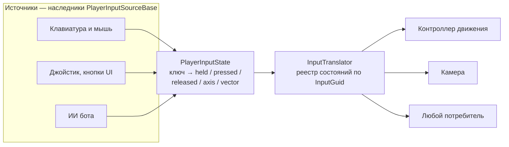
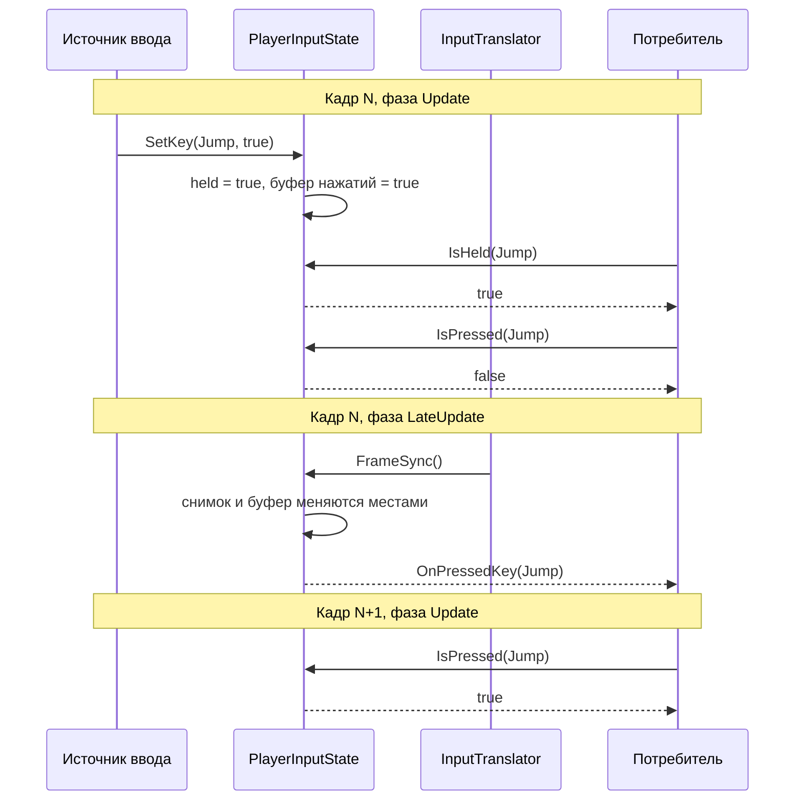

# Ввод

Слой ввода в SDK — **транспорт, а не биндинг**. Он хранит уже разобранное состояние
ввода и раздаёт его по владельцам, но не читает устройства и не знает, какие действия
есть в игре.



Границу проводит `Enumeration`: SDK работает с любым ключом, а конкретный набор —
`MoveVector`, `JumpAction`, что угодно ещё — объявляет игра своим наследником
`EnumerationProviderBase`. Поэтому один и тот же translator обслуживает и живого
игрока, и бота: бот просто пишет в состояние то же, что клавиатура.

## Состояние владельца

`PlayerInputState` — обычный C#-класс, привязанный к `InputGuid` владельца.

| Метод | Что делает |
| --- | --- |
| `IsHeld`, `IsPressed`, `IsReleased` | чтение состояния ключа |
| `GetAxis`, `GetVector` | чтение осевого и векторного ввода |
| `SetKey(key, isDown)` | обновление по состоянию устройства |
| `SetAxis`, `SetVector` | запись значений, поднимает события изменения |
| `FrameSync()` | перевод накопленного за кадр в снимок для чтения |

`SetKey` сам определяет переход: нажатие и отпускание выставляются только при смене
состояния, поэтому источник ввода может звать его каждый кадр и не следить
за предыдущим значением.

`FrameSync` меняет буферы записи и чтения местами, а не пересоздаёт их: пока
накапливается следующий кадр, читатели видят стабильный снимок и кадровая
синхронизация не мусорит.

## Источник ввода

Свой источник заводят наследником `PlayerInputSourceBase`. База отвечает за плумбинг:
ищет владельца, ждёт, пока он появится, и зовёт `InputHandle()` в фазе Update — до того,
как translator синхронизирует кадр. Читать устройство и назначать ключи остаётся
наследнику.

```csharp
public class GamepadInput : PlayerInputSourceBase
{
    [SerializeField] private PlayerBase target;

    protected override PlayerBase ResolveOwner() => target;

    protected override void InputHandle()
    {
        InputState.SetVector(GameInput.MoveVector,
            new Vector2(Input.GetAxisRaw("Horizontal"), Input.GetAxisRaw("Vertical")));

        InputState.SetKey(GameInput.JumpAction, Input.GetButton("Jump"));
    }
}
```

| Член | Для чего |
| --- | --- |
| `ResolveOwner()` | вернуть владельца или `null`, если он ещё не готов |
| `InputHandle()` | прочитать устройство и записать ключи |
| `InputState` | состояние ввода владельца |
| `Owner` | сам владелец, когда нужен не только ввод |
| `CanInput()` | добавить своё условие поверх базового |

Владельца база ищет каждый кадр, пока не найдёт: игрок появляется не сразу, и источник
на сцене обычно стартует раньше него. Свойство названо `InputState`, а не `Input`, чтобы
не перекрывать `UnityEngine.Input` — наследники читают устройство именно через него.

`KeyboardInputSourceBase` добавляет к этому одно: проверку `PRUnitySDK.DeviceInfo.IsDesktop()`
перед поиском владельца. На мобильной сборке такой источник не делает ничего.

Если источник создаётся из префаба, берите `PlayerInputSourceFactoryBase<T>` — он собирает
путь из `ResourcePaths.InputsPath` и имени префаба:

```csharp
public class GamepadInputFactory : PlayerInputSourceFactoryBase<GamepadInput>
{
    public override string Name => "GamepadInput";
}
```

## Кадровый цикл

Самое неочевидное в модуле — когда именно ввод становится виден. Удержание пишется
сразу, а нажатие и отпускание накапливаются в буфере и переходят в читаемый снимок
только в `LateUpdate` translator'а.



Отсюда два практических следствия:

- `IsHeld` виден в том же кадре, `IsPressed` и `IsReleased` — со следующего.
  Если реакция нужна кадр в кадр, подписывайтесь на `OnPressedKey`: событие приходит
  в `LateUpdate` того же кадра, в котором нажатие записано.
- Источники ввода должны писать до `LateUpdate` translator'а — то есть в `PRUpdate`,
  как это делают клавиатурный ввод, джойстик и бот. Источник, пишущий в `LateUpdate`,
  зависит от порядка выполнения скриптов и может опоздать на кадр.

## Реестр

`InputTranslator` — singleton-компонент, хранящий состояния по `InputGuid`.

```csharp
PlayerInputState input = InputTranslator.Instance.GetPlayer(player.InputGuid);

if (input.IsPressed(GameInputEnumerations.JumpAction))
    Jump();
```

| Метод | Что делает |
| --- | --- |
| `GetPlayer(guid)` | возвращает состояние, создавая его при первом обращении |
| `TryGetPlayer(guid, out state)` | то же, но без создания |
| `RemovePlayer(guid)` | убирает состояние и отписывает обработчики |
| `TryGetExisting(out translator)` | доступ к экземпляру без создания GameObject |

Событий четыре — `OnPressedKey`, `OnReleasedKey`, `OnChangeAxis`, `OnChangeVector`;
все передают `InputGuid`, поэтому подписчик может отфильтровать своего владельца.

`LateUpdate` translator'а зовёт `FrameSync()` у всех состояний по снимку списка, так что
подписчик может завести или удалить владельца прямо в обработчике, не сломав текущий проход.

Снимая владельца со сцены, зовите `RemovePlayer` — иначе его состояние продолжит
синхронизироваться каждый кадр. Для отписки при уничтожении берите `TryGetExisting`:
`Instance` создал бы translator заново уже при выключении игры.

## Смотрите также

- [Entity](../@Entity/README.md) — `IPlayer.InputGuid`, по которому берётся состояние
- [Enumeration](../Models/Enumeration/README.md) — как объявить свой набор ключей ввода
