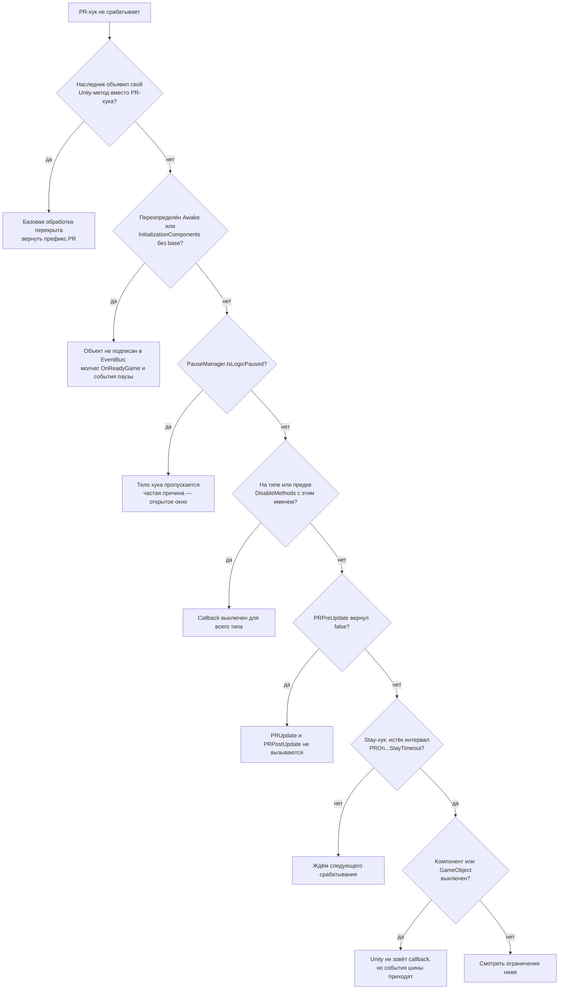

# PRMonoBehaviour

`PRMonoBehaviour` — базовый класс игровых компонентов PRUnitySDK. Он делает четыре вещи:

1. дублирует Unity lifecycle собственными хуками с префиксом `PR`, которые сами
   учитывают логическую паузу;
2. регистрирует объект в `EventBus` и в трекере сохранений при создании и снимает
   регистрацию при уничтожении;
3. унифицирует физические callback'и, добавляя к ним троттлинг `Stay` и вариант
   с `Rigidbody`;
4. даёт единый способ **выключить** отдельные callback'и на уровне типа —
   `DisableMethodsAttribute`.

Наследуйтесь от `PRMonoBehaviour` вместо `MonoBehaviour` во всём игровом коде: компонент,
написанный на голом `MonoBehaviour`, не встанет на паузу, не попадёт в `EventBus` и не
получит `OnReadyGame`.

## Три разных способа «выключить» компонент

Их легко перепутать, а последствия у них разные. Это первое, что стоит проверять,
когда метод не вызывается.

| Способ | Что отключает | Что продолжает работать |
| --- | --- | --- |
| `enabled = false` | Unity перестаёт звать `Update`, `LateUpdate`, `FixedUpdate` и физические callback'и | Подписка в `EventBus`, `OnReadyGame`, `OnPauseStateChanged`, корутины |
| Логическая пауза (`PauseManager.IsLogicPaused`) | Тела `PRUpdate`, `PRLateUpdate`, `PRFixedUpdate` и всех `PROn...` — Unity зовёт метод, база выходит на первой строке | Сам Unity callback, `OnPauseStateChanged`, корутины на реальном времени |
| `[DisableMethods(...)]` | Конкретные физические callback'и и `OnPauseStateChanged` — для всего типа сразу | Все остальные методы, включая `Update` и его фазы |
| `gameObject.SetActive(false)` | Всё, что зовёт Unity | Объект остаётся подписанным в `EventBus` до `Destroy` |

Обратите внимание: подписка на события **не** привязана к `OnEnable/OnDisable`.
Выключенный компонент продолжает получать события шины, и это сделано намеренно —
иначе окно, скрытое до открытия, пропустило бы инициализацию.

## Lifecycle

| Unity callback | PR hook | Логическая пауза | `DisableMethods` |
| --- | --- | --- | --- |
| `Awake` | `InitializationComponents()` | не проверяется | нет |
| `Start` | запуск optional coroutine-хуков | не проверяется | нет |
| `Update` | `PRPreUpdate → PRUpdate → PRPostUpdate` | пропускается | нет |
| `LateUpdate` | `PRLateUpdate()` | пропускается | нет |
| `FixedUpdate` | `PRFixedUpdate()` | пропускается | нет |
| `OnEnable` / `OnDisable` | одноимённые virtual | не проверяется | нет |
| `OnValidate` | одноимённый virtual | не проверяется | нет |
| `OnDestroy` | `UnRegisterEventsOnDestroy()` | не проверяется | нет |
| `OnTriggerEnter/Stay/Exit` | `PROnTriggerEnter/Stay/Exit` | пропускается | **да** |
| `OnCollisionEnter/Stay/Exit` | `PROnCollisionEnter/Stay/Exit` | пропускается | **да** |
| `OnTriggerEnter/Stay/Exit2D` | `PROnTriggerEnter/Stay/Exit2D` | пропускается | **да** |
| Событие паузы | `OnPauseStateChanged(args)` | — | **да** |
| Готовность игры | `OnReadyGame()` | не проверяется | нет |
| Готовность сцены | `OnReadyScene()` | не проверяется | нет |
| End of frame | `PREndOfFrame()` | через PR coroutine | нет |
| After physics | `PRLateFixedUpdate()` | через PR coroutine | нет |

`OnDestroy` объявлен приватным и не является точкой расширения: чтобы добавить свою
логику уничтожения, переопределяйте `UnRegisterEventsOnDestroy()` и вызывайте `base`.

## Типичный компонент

```csharp
public class MovingPlatform : PRMonoBehaviour
{
    [SerializeField] private float speed = 2f;

    protected override void InitializationComponents()
    {
        base.InitializationComponents();
        // Получение компонентов и начальная регистрация.
    }

    protected override void PRUpdate()
    {
        transform.position += Vector3.forward * speed * PRTime.Instance.GameDeltaTime;
    }
}
```

При переопределении `Awake`, `Start`, `OnEnable`, `OnDisable`, `OnValidate`,
`InitializationComponents` и `UnRegisterEventsOnDestroy` вызывайте базовую реализацию.
Иначе часть инфраструктуры SDK не выполнится — чаще всего теряется подписка в `EventBus`.

## Фазы Update

```csharp
protected override bool PRPreUpdate()
{
    return isReady;
}

protected override void PRUpdate()
{
    // Основная логика кадра.
}

protected override void PRPostUpdate()
{
    // Логика после основного обновления.
}
```

Если `PRPreUpdate()` возвращает `false`, обе следующие фазы пропускаются. Это дешёвый
способ отключить логику по условию, не трогая `enabled`: компонент остаётся живым,
подписанным и продолжает получать события.

## Физические callback'и

Вместо объявления Unity-методов используйте PR-хуки:

```csharp
protected override void PROnTriggerEnter(Collider other)
{
    Debug.Log($"Trigger: {other.name}");
}

protected override void PROnCollisionEnter(Collision collision)
{
    Debug.Log($"Collision: {collision.gameObject.name}");
}
```

Доступны варианты trigger callback с `Collider`, а также с `Collider` и его
`attachedRigidbody`. Если Rigidbody присутствует, базовый класс вызывает **оба**
подходящих хука — сначала вариант с Rigidbody, затем обычный. Для `Stay` можно
переопределить интервалы:

```csharp
protected override float PROnTriggerStayTimeout() => 0.1f;
protected override float PROnCollisionStayTimeout() => 0.1f;
```

Отсчёт троттлинга ведётся по `PRTime.Instance.GameTime`, то есть на паузе он не
накапливает пропущенные кадры.

Есть также `PROnTriggerEnter2D`, `PROnTriggerStay2D` и `PROnTriggerExit2D`.
Коллизионных 2D-хуков в базовом классе нет.

## DisableMethodsAttribute — блокировка callback'ов

Главная особенность базового класса, которую стоит знать до того, как она удивит.

`PRMonoBehaviour` **объявляет все физические callback'и сразу**. Unity определяет
наличие метода по типу и подписывает объект на соответствующие события физики, поэтому
любой наследник получает `OnTriggerStay` и `OnCollisionStay` — даже если ему это не
нужно и в нём нет ни строчки соответствующей логики. Отказаться, просто не переопределяя
`PROnTriggerStay`, нельзя: вызов до наследника уже дошёл.

`DisableMethodsAttribute` — способ отписаться:

```csharp
[DisableMethods("OnTriggerStay", "OnCollisionStay")]
public class SensorWithoutStay : PRMonoBehaviour
{
    protected override void PROnTriggerEnter(Collider other) { }
}
```

### Что можно отключить

Атрибут не универсален: он работает только там, где вызывающий код сам спрашивает
`this.IsMethodDisabled(...)`. В текущем `PRMonoBehaviour` это ровно десять имён:

```text
OnTriggerEnter      OnCollisionEnter     OnTriggerEnter2D
OnTriggerStay       OnCollisionStay      OnTriggerStay2D
OnTriggerExit       OnCollisionExit      OnTriggerExit2D
OnPauseStateChanged
```

`Update`, `LateUpdate`, `FixedUpdate` и их фазы через атрибут отключить **нельзя** —
для них используйте `PRPreUpdate()` или `enabled`.

### Имена задаются строками

Указывается имя **Unity-метода**, а не PR-хука: `"OnTriggerStay"`, не
`"PROnTriggerStay"`. При этом `nameof` в наследнике недоступен — физические callback'и
объявлены в базовом классе как `private`, поэтому компилятор их не видит (CS0122).
Остаётся строковый литерал: опечатка не вызовет ошибку компиляции, но и хук не отключит.

Исключение — `OnPauseStateChanged`: он `public virtual`, для него `nameof` работает:

```csharp
[DisableMethods(nameof(OnPauseStateChanged))]
public class IgnoresPause : PRMonoBehaviour { }
```

Если блокировок в проекте станет много, имеет смысл завести константы рядом с
атрибутом, чтобы литералы не расползались по коду.

### Наследование заменяет список, а не дополняет его

Атрибут объявлен с `Inherited = true`, и это поведение легко понять неправильно:

```csharp
[DisableMethods("OnTriggerStay", "OnCollisionStay")]
public class Base : PRMonoBehaviour { }

// Наследует список базового: OnTriggerStay, OnCollisionStay.
public class ChildA : Base { }

// НЕ дополняет, а заменяет: отключён только OnTriggerEnter,
// а OnTriggerStay и OnCollisionStay снова разрешены.
[DisableMethods("OnTriggerEnter")]
public class ChildB : Base { }

// Пустой атрибут снимает все блокировки базового класса.
[DisableMethods()]
public class ChildC : Base { }
```

Такое поведение даёт бесплатный способ вернуть callback наследнику, но и создаёт
ловушку: добавив атрибут в производный класс, вы незаметно включаете обратно всё, что
отключал базовый. Список приходится переписывать целиком.

### Цена и порядок проверок

Рефлексия выполняется один раз на тип: `ClassExtension` держит кеш
`ConcurrentDictionary<Type, HashSet<string>>`, поэтому на вызове остаётся поиск по
словарю и по набору строк. Без кеша `GetCustomAttribute` вызывался бы на каждом
`OnTriggerStay`/`OnCollisionStay` — то есть каждый физический кадр на каждом контакте,
плюс линейный поиск по `List<string>`.

Проверка паузы стоит **перед** проверкой атрибута: на паузе вызов отбрасывается сразу,
не заглядывая в кеш. Порядок безопасен, потому что обе проверки не имеют побочных
эффектов, а счётчики троттлинга (`LastTriggerTick`, `LastCollisionTick`) обновляются
после них.

Атрибут проверяется по фактическому типу экземпляра (`obj.GetType()`), поэтому включить
или выключить блокировку для отдельного объекта в рантайме нельзя — только для типа
целиком. В `ClassExtension` есть TODO о scope, который позволял бы временно выполнять
заблокированный метод; для этого потребуется анализ стека вызовов.

### Делегирование через прокси

`TriggerProxy` и `CollisionProxy` перенаправляют события через публичные
`Invoke...`-методы базового класса, а те внутри зовут те же приватные Unity-обёртки.
Значит проверки паузы и `DisableMethodsAttribute` сохраняются и для делегированных
вызовов — прокси не является обходным путём.

## Пауза

`PRMonoBehaviour` реализует `IPauseStateListener`, поэтому подписка на событие паузы
происходит автоматически. Базовая реализация вызывает method-хуки стадии
`MethodHookStage.Pause`:

```csharp
public class Turret : PRMonoBehaviour
{
    [MethodHook(MethodHookStage.Pause)]
    private void OnPause()
    {
        // Реакция на смену состояния паузы.
    }
}
```

При переопределении `OnPauseStateChanged` вызывайте `base`, иначе хуки стадии `Pause`
перестанут отрабатывать. И наоборот: `[DisableMethods("OnPauseStateChanged")]` отключает
только базовую реализацию с её хуками — собственный код переопределённого метода
выполнится в любом случае, так как проверка находится внутри базовой реализации.

Аргумент `PauseStateEventArgs` приходит и при пользовательской паузе (`IsCustom`),
поэтому не считайте каждое событие сменой глобального состояния — сверяйтесь с
`PRUnitySDK.PauseManager.IsLogicPaused`.

## Готовность игры и сцены

Класс подписан на `IReadyGameEvent` и `IReadySceneGameEvent`:

- `OnReadyGame()` — все системы проекта загружены (`GameplayEvents.RaiseGameReady`);
- `OnReadyScene()` — сцена сменилась и готова (`SceneChanger`).

Это правильное место для логики, которой нужны менеджеры и загруженные данные: в `Awake`
их может ещё не быть.

## Автоматическая регистрация

`InitializationComponents()` вызывает `RegisterEventsOnCreated()`:

- объект подписывается в `EventBus` на все реализованные `IGlobalSubscriber`-интерфейсы;
- объект добавляется в `PRUnitySDK.Trackers.Saveables`.

При уничтожении `UnRegisterEventsOnDestroy()` выполняет обратные операции. Регистрация
не привязана к `OnEnable/OnDisable`, поэтому выключенный объект остаётся подписанным
до уничтожения.

## Дополнительные возможности

### PRDestroy

```csharp
PRDestroy(gameObject);
PRDestroy(gameObject, timeout: 2f);
```

Задержка использует `PRTimeType.GameTime`, то есть уважает паузу и замедление времени.
Отрицательный timeout игнорируется — объект не будет уничтожен вовсе.

### LateFixedUpdate и EndOfFrame

```csharp
protected override bool UseCoroutineLateFixedUpdate() => true;
protected override void PRLateFixedUpdate() { }

protected override bool UseCoroutineWaitForEndOfFrame() => true;
protected override void PREndOfFrame() { }
```

Эти хуки реализованы бесконечными корутинами, запускаемыми в `Start`. Флаг читается
один раз при старте, поэтому включить их позже нельзя.

### Сохранение

`TrySaveData()` — точка расширения `ISaveable`: объект перекладывает своё состояние
в `ProjectData`. По умолчанию возвращает успех, ничего не записывая — своего состояния
у большинства объектов нет.

Вызывается синхронно, дважды: перед каждой записью на диск — одним проходом по всем
объектам, чтобы снимок получился согласованным, — и ещё раз при уходе объекта со сцены,
пока его есть кому спросить. Последний снимок берётся, только пока игра идёт, менеджер
жив и сохранение прочитано.

Обратной операции у контракта нет: момент восстановления у всех разный, поэтому тот, кому
нужно подняться из сохранения, подписывается на `GameManager.Instance.ReadySignal` сам.
Подробности — в [GameDataStorage](../GameDataStorage/README.md).

## PRMonoBehaviourHost

Глобальный host:

- запускает корутины без локального владельца;
- обслуживает зарегистрированные `IPRUpdate`, `IPRFixedUpdate` и `IPRTickable`;
- выполняет ручной `Physics.Simulate`, когда simulation mode установлен в `Script`;
- использует интервал тика из настроек проекта.

На этом же тике работают [фоновые задачи](../BackgroundTasks/README.md): трекер задач
регистрируется как один `IPRTickable` и сам решает, чьё время пришло, — поэтому их
количество не влияет ни на число корутин, ни на число подписчиков хоста.

Коллекции host нельзя безопасно изменять во время их обхода без дополнительной защиты.
Регистрируйте и снимайте объекты на границах lifecycle, а не внутри callback того же цикла.

## Метод не вызывается — что проверить



По порядку, от самого частого:

1. Наследник объявил собственный Unity-метод (`OnTriggerEnter`, `LateUpdate`) вместо
   PR-хука — базовая обработка перекрыта и не выполняется.
2. Переопределён `Awake`/`InitializationComponents` без вызова `base` — объект не
   подписан в `EventBus`, поэтому молчат `OnReadyGame`, `OnReadyScene` и события паузы.
3. Активна логическая пауза — проверьте `PRUnitySDK.PauseManager.IsLogicPaused` и кто
   удерживает блокировку. Частая причина — открытое окно `MonoWindow`.
4. На типе или его предке висит `[DisableMethods(...)]` с этим именем.
5. `PRPreUpdate()` возвращает `false` — тогда молчат `PRUpdate` и `PRPostUpdate`.
6. Для `Stay`-хуков не истёк интервал из `PROnTriggerStayTimeout` /
   `PROnCollisionStayTimeout`.
7. Компонент или GameObject выключен — но помните, что события шины он всё равно получает.

## Ограничения

- Unity lifecycle-методы являются виртуальными; забытый вызов `base` может отключить
  обязательную инфраструктуру.
- Имена в `DisableMethodsAttribute` — строки без проверки на этапе компиляции.
- Кеш `IsMethodDisabled()` живёт до перезагрузки домена: атрибут читается один раз
  на тип, менять блокировки в рантайме нельзя.
- Атрибут производного класса заменяет список базового целиком.
- Наследник, объявивший собственный Unity `OnTrigger...` или `LateUpdate`, обходит
  PR-обработку вместе с паузой. Используйте методы с префиксом `PR`/`PROn`.
- `OnDestroy` приватный: расширяйте `UnRegisterEventsOnDestroy()`.
