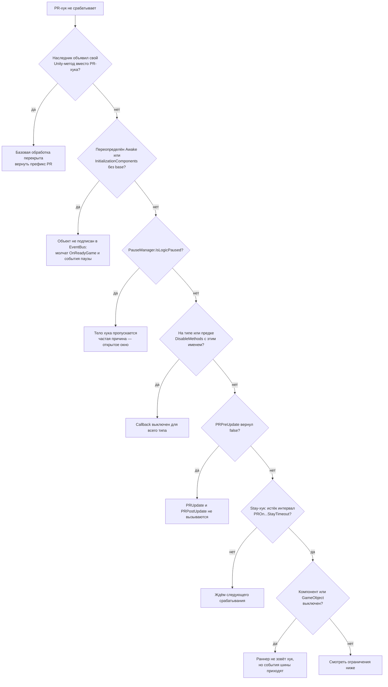

# PRMonoBehaviour

`PRMonoBehaviour` — базовый класс игровых компонентов PRUnitySDK. Он делает четыре вещи:

1. дублирует Unity lifecycle собственными хуками с префиксом `PR`, которые сами
   учитывают логическую паузу;
2. регистрирует объект в `EventBus` и в трекере сохранений при создании и снимает
   регистрацию при уничтожении;
3. унифицирует физические callback'и, добавляя к ним троттлинг `Stay` и вариант
   с `Rigidbody`;
4. даёт единый способ **выключить** отдельные callback'и на уровне типа —
   `DisableMethodsAttribute`.

Наследуйтесь от `PRMonoBehaviour` вместо `MonoBehaviour` во всём игровом коде: компонент,
написанный на голом `MonoBehaviour`, не встанет на паузу, не попадёт в `EventBus` и не
получит `OnReadyGame`.

## Три разных способа «выключить» компонент

Их легко перепутать, а последствия у них разные. Когда метод не вызывается, проверьте это первым.

| Способ | Что отключает | Что продолжает работать |
| --- | --- | --- |
| `enabled = false` | Unity перестаёт звать `Update`, `LateUpdate`, `FixedUpdate` и физические callback'и | Подписка в `EventBus`, `OnReadyGame`, `OnPauseStateChanged`, корутины |
| Логическая пауза (`PauseManager.IsLogicPaused`) | Тела `PRUpdate`, `PRLateUpdate`, `PRFixedUpdate` и всех `PROn...` — Unity зовёт метод, база выходит на первой строке | Сам Unity callback, `OnPauseStateChanged`, корутины на реальном времени |
| `[DisableMethods(...)]` | Конкретные физические callback'и и `OnPauseStateChanged` — для всего типа сразу | Все остальные методы, включая `Update` и его фазы |
| `gameObject.SetActive(false)` | Всё, что зовёт Unity | Объект остаётся подписанным в `EventBus` до `Destroy` |

Подписка на события **не** привязана к `OnEnable/OnDisable`: выключенный компонент продолжает получать события шины.

## Lifecycle

| Unity callback | PR hook | Логическая пауза | `DisableMethods` |
| --- | --- | --- | --- |
| `Awake` | `InitializationComponents()` | не проверяется | нет |
| `Start` | запуск optional coroutine-хуков; с этого момента раннер вызывает объект | не проверяется | нет |
| Раннер, фаза Update | `PRPreUpdate → PRUpdate → PRPostUpdate` | пропускается | нет |
| Раннер, фаза LateUpdate | `PRLateUpdate()` | пропускается | нет |
| Раннер, фаза FixedUpdate | `PRFixedUpdate()` | пропускается | нет |
| `OnEnable` / `OnDisable` | одноимённые virtual; регистрация в раннере и снятие | не проверяется | нет |
| `OnValidate` | одноимённый virtual | не проверяется | нет |
| `OnDestroy` | `UnRegisterEventsOnDestroy()` | не проверяется | нет |
| `OnTriggerEnter/Stay/Exit` | `PROnTriggerEnter/Stay/Exit` | пропускается | **да** |
| `OnCollisionEnter/Stay/Exit` | `PROnCollisionEnter/Stay/Exit` | пропускается | **да** |
| `OnTriggerEnter/Stay/Exit2D` | `PROnTriggerEnter/Stay/Exit2D` | пропускается | **да** |
| Событие паузы | `OnPauseStateChanged(args)` | — | **да** |
| Готовность игры | `OnReadyGame()` | не проверяется | нет |
| Готовность сцены | `OnReadyScene()` | не проверяется | нет |
| End of frame | `PREndOfFrame()` | через PR coroutine | нет |
| After physics | `PRLateFixedUpdate()` | через PR coroutine | нет |

`OnDestroy` приватный и не является точкой расширения: для своей логики уничтожения переопределяйте `UnRegisterEventsOnDestroy()` и вызывайте `base`.

## Типичный компонент

```csharp
public class MovingPlatform : PRMonoBehaviour
{
    [SerializeField] private float speed = 2f;

    protected override void InitializationComponents()
    {
        base.InitializationComponents();
        // Получение компонентов и начальная регистрация.
    }

    protected override void PRUpdate()
    {
        transform.position += Vector3.forward * speed * PRTime.Instance.GameDeltaTime;
    }
}
```

При переопределении `Awake`, `Start`, `OnEnable`, `OnDisable`, `OnValidate`,
`InitializationComponents` и `UnRegisterEventsOnDestroy` вызывайте базовую реализацию.
Иначе часть инфраструктуры SDK не выполнится — чаще всего теряется подписка в `EventBus`.

## Раннер обновлений

`PRMonoBehaviour` **не объявляет** Unity-методы `Update`, `LateUpdate` и `FixedUpdate`.
Их вызывает один `PRMonoBehaviourHost`, а `PRUpdateRunner` обходит только тех,
кто переопределил хук:

| Фаза | Попадает, если тип переопределил |
| --- | --- |
| Update | `PRUpdate`, `PRPreUpdate` или `PRPostUpdate` |
| LateUpdate | `PRLateUpdate` |
| FixedUpdate | `PRFixedUpdate` |

Поведение повторяет Unity:

- вызываются только включённые объекты: регистрация в базовом `OnEnable`, снятие в
  `OnDisable` и `OnDestroy` — поэтому `base.OnEnable()`/`base.OnDisable()` обязательны;
- первый вызов — не раньше базового `Start` (без `base.Start()` объект не обновится);
- порядок между типами задаёт `[DefaultExecutionOrder]` самого класса;
- исключение в одном объекте пишется в лог и не обрывает остальных;
- объекты, включённые посреди прохода, получают вызов со следующего кадра.

Пауза проверяется перед **каждым** объектом: если её включили посреди прохода (шаг
туториала, катсцена, окно), остальные в этом кадре уже не вызываются.

Порядок кадра: `PRTime` (`[DefaultExecutionOrder(-1000)]`, работает и на паузе) →
хост: Update-проход раннера, затем `IPRUpdate`-классы и тик. В FixedUpdate хост
сначала обходит все `PRFixedUpdate`, затем делает `Physics.Simulate`, затем
`IPRFixedUpdate`-классы — силы, приложенные в шаге, физика обработает в том же шаге.

Кому нужно работать **на паузе**, объявляет собственный Unity-метод (`private void Update()`),
как `PRTime` и `AdMessage`: раннер на паузе не вызывает никого.

Хост создаётся первой регистрацией, а не при инициализации SDK. Счётчики для отладки:
`PRMonoBehaviourHost.RunnerUpdateCount`, `RunnerLateUpdateCount`, `RunnerFixedUpdateCount`.
Отдельная строка профайлера на тип включается дефайном `PRSDK_RUNNER_PROFILING`; без него
время видно под хостом.

## Фазы Update

```csharp
protected override bool PRPreUpdate()
{
    return isReady;
}

protected override void PRUpdate()
{
    // Основная логика кадра.
}

protected override void PRPostUpdate()
{
    // Логика после основного обновления.
}
```

Если `PRPreUpdate()` возвращает `false`, `PRUpdate` и `PRPostUpdate` пропускаются.
Так логика отключается по условию без `enabled`: компонент остаётся живым, подписанным и получает события.

## Физические callback'и

Вместо объявления Unity-методов используйте PR-хуки:

```csharp
protected override void PROnTriggerEnter(Collider other)
{
    Debug.Log($"Trigger: {other.name}");
}

protected override void PROnCollisionEnter(Collision collision)
{
    Debug.Log($"Collision: {collision.gameObject.name}");
}
```

Доступны варианты trigger callback с `Collider`, а также с `Collider` и его
`attachedRigidbody`. Если Rigidbody присутствует, базовый класс вызывает **оба**
подходящих хука — сначала вариант с Rigidbody, затем обычный. Для `Stay` можно
переопределить интервалы:

```csharp
protected override float PROnTriggerStayTimeout() => 0.1f;
protected override float PROnCollisionStayTimeout() => 0.1f;
```

Отсчёт троттлинга ведётся по `PRTime.Instance.GameTime`, то есть на паузе он не
накапливает пропущенные кадры.

Есть также `PROnTriggerEnter2D`, `PROnTriggerStay2D` и `PROnTriggerExit2D`.
Коллизионных 2D-хуков в базовом классе нет.

## DisableMethodsAttribute — блокировка callback'ов

`PRMonoBehaviour` **объявляет все физические callback'и сразу**, поэтому любой наследник
получает `OnTriggerStay` и `OnCollisionStay`, даже без своей логики. Не переопределение
`PROnTriggerStay` их не отключает: вызов до наследника уже дошёл.

`DisableMethodsAttribute` — способ отписаться:

```csharp
[DisableMethods("OnTriggerStay", "OnCollisionStay")]
public class SensorWithoutStay : PRMonoBehaviour
{
    protected override void PROnTriggerEnter(Collider other) { }
}
```

### Что можно отключить

В текущем `PRMonoBehaviour` атрибут работает ровно для десяти имён:

```text
OnTriggerEnter      OnCollisionEnter     OnTriggerEnter2D
OnTriggerStay       OnCollisionStay      OnTriggerStay2D
OnTriggerExit       OnCollisionExit      OnTriggerExit2D
OnPauseStateChanged
```

`Update`, `LateUpdate`, `FixedUpdate` и их фазы через атрибут отключить **нельзя** —
для них используйте `PRPreUpdate()` или `enabled`.

### Имена задаются строками

Указывайте имя **Unity-метода**, а не PR-хука: `"OnTriggerStay"`, не `"PROnTriggerStay"`.
`nameof` для них недоступен (они `private` в базовом классе, CS0122), поэтому опечатка в строке
не даёт ошибки компиляции и не отключает хук.

Исключение — `OnPauseStateChanged`: он `public virtual`, для него `nameof` работает:

```csharp
[DisableMethods(nameof(OnPauseStateChanged))]
public class IgnoresPause : PRMonoBehaviour { }
```

### Наследование заменяет список, а не дополняет его

Атрибут наследуется (`Inherited = true`), но производный класс заменяет список базового:

```csharp
[DisableMethods("OnTriggerStay", "OnCollisionStay")]
public class Base : PRMonoBehaviour { }

// Наследует список базового: OnTriggerStay, OnCollisionStay.
public class ChildA : Base { }

// НЕ дополняет, а заменяет: отключён только OnTriggerEnter,
// а OnTriggerStay и OnCollisionStay снова разрешены.
[DisableMethods("OnTriggerEnter")]
public class ChildB : Base { }

// Пустой атрибут снимает все блокировки базового класса.
[DisableMethods()]
public class ChildC : Base { }
```

Так можно вернуть callback наследнику, но ловушка: добавив атрибут в производный класс, вы
незаметно включаете обратно всё, что отключал базовый. Список приходится переписывать целиком.

### Цена и порядок проверок

Атрибут проверяется по фактическому типу экземпляра (`obj.GetType()`), поэтому включить
или выключить блокировку для отдельного объекта в рантайме нельзя — только для типа целиком.

### Делегирование через прокси

Для вызовов, переданных через `TriggerProxy` и `CollisionProxy`, проверки паузы и
`DisableMethodsAttribute` действуют так же: прокси их не обходит.

## Пауза

`PRMonoBehaviour` реализует `IPauseStateListener` и подписывается на паузу сам. Базовая
реализация вызывает method-хуки стадии `MethodHookStage.Pause`:

```csharp
public class Turret : PRMonoBehaviour
{
    [MethodHook(MethodHookStage.Pause)]
    private void OnPause()
    {
        // Реакция на смену состояния паузы.
    }
}
```

При переопределении `OnPauseStateChanged` вызывайте `base`, иначе хуки стадии `Pause` не сработают.
`[DisableMethods("OnPauseStateChanged")]` отключает только базовую реализацию с её хуками:
код переопределённого метода выполняется всё равно.

Аргумент `PauseStateEventArgs` приходит и при пользовательской паузе (`IsCustom`),
поэтому не считайте каждое событие сменой глобального состояния — сверяйтесь с
`PRUnitySDK.PauseManager.IsLogicPaused`.

## Готовность игры и сцены

Класс подписан на `IReadyGameEvent` и `IReadySceneGameEvent`:

- `OnReadyGame()` — все системы проекта загружены (`GameplayEvents.RaiseGameReady`);
- `OnReadyScene()` — сцена сменилась и готова (`SceneChanger`).

Для логики, которой нужны менеджеры и загруженные данные, используйте эти методы: в `Awake` их может ещё не быть.

## Автоматическая регистрация

`InitializationComponents()` вызывает `RegisterEventsOnCreated()`:

- объект подписывается в `EventBus` на все реализованные `IGlobalSubscriber`-интерфейсы;
- объект добавляется в `PRUnitySDK.Trackers.Saveables`.

При уничтожении `UnRegisterEventsOnDestroy()` выполняет обратные операции. Регистрация
не привязана к `OnEnable/OnDisable`, поэтому выключенный объект остаётся подписанным
до уничтожения.

## Дополнительные возможности

### PRDestroy

```csharp
PRDestroy(gameObject);
PRDestroy(gameObject, timeout: 2f);
```

Задержка использует `PRTimeType.GameTime`, то есть уважает паузу и замедление времени.
Отрицательный timeout игнорируется — объект не будет уничтожен вовсе.

### LateFixedUpdate и EndOfFrame

```csharp
protected override bool UseCoroutineLateFixedUpdate() => true;
protected override void PRLateFixedUpdate() { }

protected override bool UseCoroutineWaitForEndOfFrame() => true;
protected override void PREndOfFrame() { }
```

Флаг читается один раз при старте: включить хук позже нельзя.

### Сохранение

`TrySaveData()` — точка расширения `ISaveable`: объект перекладывает своё состояние
в `ProjectData`. По умолчанию возвращает успех и ничего не записывает.

Вызывается синхронно, дважды: перед каждой записью на диск одним проходом по всем объектам
и при уходе объекта со сцены. Последний снимок берётся, только пока игра идёт, менеджер
жив и сохранение прочитано.

Обратной операции у контракта нет: кому нужно восстановиться из сохранения, подписывается
на `GameManager.Instance.ReadySignal` сам.
Подробности — в [GameDataStorage](../GameDataStorage/README.md).

## PRMonoBehaviourHost

Глобальный host:

- запускает корутины без локального владельца;
- единственный, у кого Unity вызывает методы кадра: через них крутит `PRUpdateRunner`;
- обслуживает зарегистрированные `IPRUpdate`, `IPRFixedUpdate` и `IPRTickable`;
- выполняет ручной `Physics.Simulate`, когда simulation mode установлен в `Script`;
- использует интервал тика из настроек проекта.

На этом же тике работают [фоновые задачи](../BackgroundTasks/README.md): трекер задач
регистрируется как один `IPRTickable`, поэтому их количество не влияет ни на число корутин, ни на число подписчиков хоста.

Не меняйте коллекции host во время обхода: регистрируйте и снимайте объекты на границах
lifecycle, а не внутри callback того же цикла.

## Метод не вызывается — что проверить


```mermaid
flowchart TD
    Q["PR-хук не срабатывает"] --> A{"Наследник объявил свой<br/>Unity-метод вместо PR-хука?"}
    A -->|да| A1["Базовая обработка перекрыта<br/>вернуть префикс PR"]
    A -->|нет| B{"Переопределён Awake или<br/>InitializationComponents без base?"}

    B -->|да| B1["Объект не подписан в EventBus:<br/>молчат OnReadyGame и события паузы"]
    B -->|нет| C{"PauseManager.IsLogicPaused?"}

    C -->|да| C1["Тело хука пропускается<br/>частая причина — открытое окно"]
    C -->|нет| D{"На типе или предке<br/>DisableMethods с этим именем?"}

    D -->|да| D1["Callback выключен для всего типа"]
    D -->|нет| E{"PRPreUpdate вернул false?"}

    E -->|да| E1["PRUpdate и PRPostUpdate не вызываются"]
    E -->|нет| F{"Stay-хук: истёк интервал<br/>PROn...StayTimeout?"}

    F -->|нет| F1["Ждём следующего срабатывания"]
    F -->|да| G{"Компонент или GameObject<br/>выключен?"}

    G -->|да| G1["Раннер не зовёт хук,<br/>но события шины приходят"]
    G -->|нет| H["Смотреть ограничения ниже"]
```

По порядку, от самого частого:

1. Наследник объявил собственный Unity-метод (`OnTriggerEnter`, `LateUpdate`) вместо
   PR-хука — базовая обработка перекрыта.
2. Переопределён `Awake`/`InitializationComponents` без `base` — объект не подписан в `EventBus`,
   молчат `OnReadyGame`, `OnReadyScene` и события паузы.
3. Активна логическая пауза — проверьте `PRUnitySDK.PauseManager.IsLogicPaused` и кто
   удерживает блокировку. Частая причина — открытое окно `MonoWindow`.
4. На типе или его предке висит `[DisableMethods(...)]` с этим именем.
5. `PRPreUpdate()` возвращает `false` — тогда молчат `PRUpdate` и `PRPostUpdate`.
6. Для `Stay`-хуков не истёк интервал из `PROnTriggerStayTimeout` /
   `PROnCollisionStayTimeout`.
7. Компонент или GameObject выключен — но события шины он всё равно получает.
8. Переопределены `OnEnable`, `OnDisable` или `Start` без `base` — объект не попал в раннер
   или не отмечен стартовавшим, `PRUpdate` не приходит. Проверьте `PRMonoBehaviourHost.Runner*Count`.

## Ограничения

- Unity lifecycle-методы являются виртуальными; забытый вызов `base` может отключить
  обязательную инфраструктуру.
- Имена в `DisableMethodsAttribute` — строки без проверки на этапе компиляции.
- Кеш `IsMethodDisabled()` живёт до перезагрузки домена: атрибут читается один раз
  на тип, менять блокировки в рантайме нельзя.
- Атрибут производного класса заменяет список базового целиком.
- Наследник, объявивший собственный Unity `OnTrigger...`, `Update` или `LateUpdate`,
  обходит PR-обработку вместе с паузой. Используйте методы с префиксом `PR`/`PROn` —
  кроме случая, когда работа на паузе и нужна.
- `OnDestroy` приватный: расширяйте `UnRegisterEventsOnDestroy()`.
