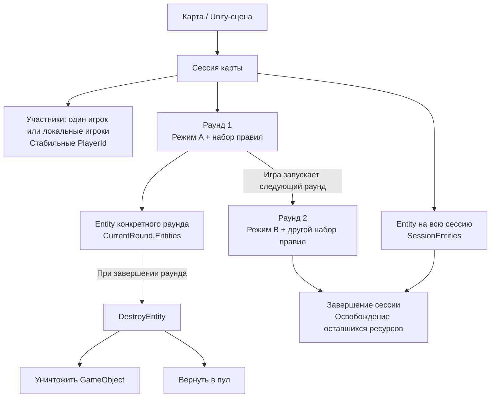
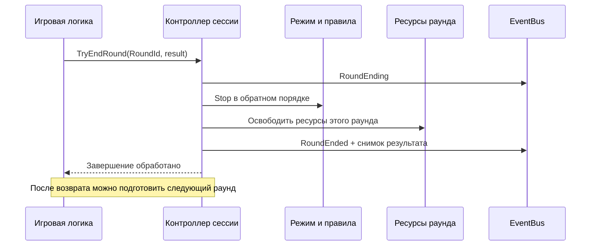
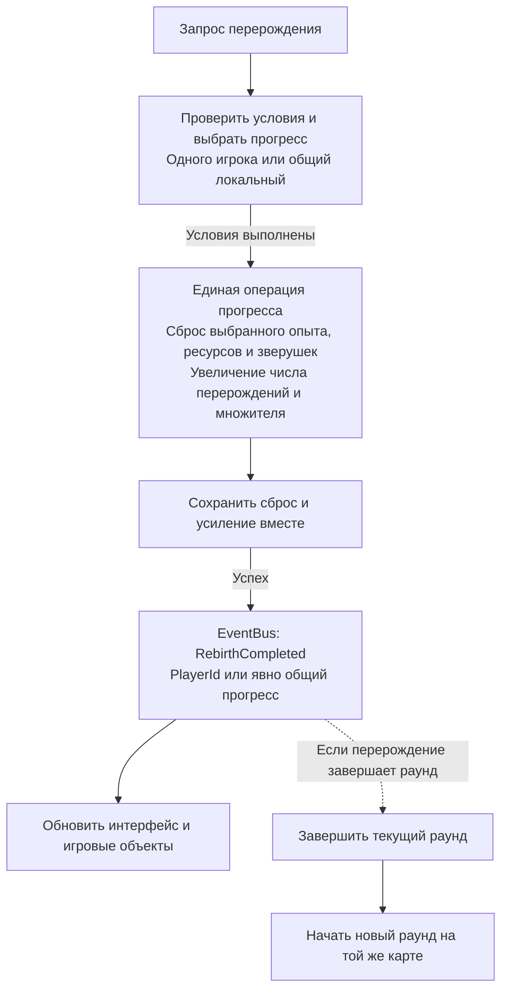

# Game Sessions

Подключаемый модуль в пространстве имён `PRGameSessions`. Одна сессия соответствует
карте, внутри неё последовательно проходят раунды с разными режимами и правилами.
Модуль рассчитан на одиночную игру и локальный мультиплеер на одном компьютере.
Сеть не рассматривается. Спавн персонажей и выдачу наград реализует игра.

## Общая схема



Срок жизни определяет, **когда** освободить Entity: при завершении её раунда или
сессии. Настройка Destroy/HideInPool определяет, **как** её освободить. Участник
остаётся в сессии, даже если его персонаж принадлежал закончившемуся раунду.



Контроллер выполняет обязательную очистку сам. EventBus уведомляет UI, звук,
статистику и другие системы; порядок их подписок не управляет очисткой.

## Как сюда вписывается перерождение

**Это предлагаемая интеграция, модуль Rebirth пока не реализован.** Перерождение
меняет сохраняемый прогресс. Оно может завершать игровой раунд, если такой цикл
нужен игре, но не обязано завершать сессию карты.



Удаление Entity зверушки не удаляет её запись из сохранения: эти действия связывает
операция перерождения. Постоянные покупки и улучшения сохраняются по правилам игры.
В локальном мультиплеере личное перерождение не должно автоматически завершать
общий раунд остальных игроков; такое поведение задаётся явно.

## Подключение

Сервис регистрируется как `IGameSessionsService` и доступен через
`PRUnitySDK.GameSessions` после `PRUnitySDK.ReadySignal`. По умолчанию он выключен.
Без запуска сессии модуль не подписывается на события и не обходит сущности.

Для карты добавьте `SessionSceneHost` на отдельный объект сцены. Компонент явно
включает модуль, ждёт готовности SDK, запускает сессию и передаёт ей время из
`PRUpdate`, с учётом логической паузы. Отключение/удаление компонента завершает
его сессию с причиной `Cancelled`; обработанная выгрузка сцены — `SceneUnloaded`.
Одновременно сервис обслуживает одну карту. Второй host не получает владение
активной сессией и не тикает её. Host не должен быть дочерним объектом персонажа.

В меню Create → PRUnitySDK → Game Sessions доступны Manual Mode и Time Limit Rule.
Назначьте режим и правила в `firstMode`/`firstRules`, чтобы сразу начать первый раунд.
Без `firstMode` запускается только сессия. `StartNextRound(mode, rules)` принимает
другой режим и правила после завершения предыдущего раунда.

При собственном управлении сценами host не нужен:

```csharp
using PRGameSessions;

PRUnitySDK.ReadySignal.SubscribeOnReady(() =>
{
    var sessions = PRUnitySDK.GameSessions;
    sessions.SetEnabled(true);
    if (!sessions.TryStartSession("Maps/Arena")) return;
    sessions.TryJoin(new SessionParticipant(42, "red"));
    if (sessions.TryPrepareRound(new RoundPlan("Deathmatch",
        () => new ManualRoundMode(), () => new TimeLimitRule(120f))))
        sessions.TryStartRound(sessions.CurrentRound.RoundId);
});
```

Собственный хост вызывает `Tick(deltaTime)` только во время игровой логики.
Не запускайте второй tick вместе с `SessionSceneHost`. Конфигурация, зависящая
от сохранений, дополнительно ждёт `GameManager.ReadySignal`.

`SetEnabled(false)` завершает активный раунд и сессию и освобождает их ресурсы.
Для другого проекта можно не включать модуль либо не переносить эту папку.
Core/Entity и другие модули не зависят от её типов. В проекте, который использует
host или свои режимы, перед удалением папки нужно убрать эти компоненты и обращения.

## Жизненный цикл

Сессия: `Idle → Active → Ending → Ended`.
Раунд: `Preparing → Playing → Ending → Ended`. Во время подготовки игра может
загрузить данные, расставить игроков и выполнить свои подготовительные действия.
`TryStartRound` переводит подготовленный раунд в игру. Каждая сессия и каждый
раунд получают новый GUID; номера раундов начинаются с 1 для каждой сессии.

`RoundPlan` содержит фабрику режима и фабрики правил. Каждая фабрика должна
возвращать новый `RoundBehaviour`: не храните runtime-состояние в ScriptableObject.
Режим, затем правила в порядке списка получают `Prepare`, `Start`, `Tick`.
`Stop` вызывается в обратном порядке для всех начавших подготовку объектов,
включая объект с исключением в `Prepare`. Затем контроллер освобождает scope.

`RoundContext.TryEnd(result)` проверяет GUID своего раунда. Первый запрос принят,
повторный отклонён. Внутри callback запрос откладывается до выхода из операции.
Запоздавший callback прошлого раунда возвращает false. Завершение сессии также
проверяет её GUID. Исключение режима завершает раунд с `Error`; ошибки Stop и
освобождения журналируются, очистка остальных ресурсов продолжается.

Участники регистрируются явно по стабильному PlayerId. Это отдельные записи,
не ссылки на `PlayerBase`: уничтожение персонажа не удаляет участника сессии.
Не используйте для участника Id сущности, который меняется при новом спавне.
Результат содержит причину, WinnerPlayerId и/или WinnerTeamId. Отмена и ошибка
не считаются ничьей. Счёт серии и таблицу результатов ведёт игра по событиям.

## Entity и ресурсы

```csharp
var sessions = PRUnitySDK.GameSessions;
var entity = PRUnitySDK.Managers.ObjectPool.ShowEntity(prefab, position);
sessions.CurrentRound.Entities.OwnEntity(entity); // после выдачи из пула
// Для сущности на всю карту: sessions.SessionEntities.OwnEntity(entity);
```

Владение назначается явно конкретному scope. Старое поле `EntityLifeTime` не
сканируется: метка Round не позволяет определить, какому раунду принадлежит объект.
Scope вызывает обычный `DestroyEntity()`, сохраняя выбор Destroy/HideInPool самой
сущности. Он не вызывает глобальные `EntityTracker.Clear*` и не снимает pooled
сущность с регистрации в трекере. `SessionEntityBinding` снимает связь при
DestroyEntity, уничтожении объекта и новой выдаче из пула. Явное назначение другому
scope переносит владение; очистка старого scope не освободит новый экземпляр lease.

Обычное отключение GameObject не снимает владение: это может быть временная пауза.
При завершении scope уже находящийся в пуле объект повторно не освобождается.
Повторно назначайте владельца после каждого `ShowEntity`, не из `OnEnable`.
Персонаж может принадлежать раунду, а участник сессии сохраняет команду и идентичность.

`scope.Own(IDisposable)` принимает также подписки и другие ресурсы. Один такой
ресурс должен принадлежать одному scope. `Forget` снимает владение без Dispose.
Закрытый scope не принимает ресурсы и повторно ничего не освобождает.

## EventBus

Подписчик реализует `IGameSessionsEvents`, регистрируется через `EventBus.Subscribe`
и симметрично удаляется через `EventBus.Unsubscribe`.

```csharp
public void OnSessionEvent(SessionEvent notification)
{
    if (notification.Kind != SessionEventKind.RoundEnded) return;
    var finished = notification.Snapshot;
    // finished.SessionId, RoundId, Result, Participants — снимок завершённого раунда.
}
```

События: SessionStarted/Ending/Ended, RoundPreparing/Started/Ending/Ended,
ParticipantJoined/Left. Каждое содержит неизменяемый `SessionSnapshot`; события
участников также содержат PlayerId. `RoundEnding` предшествует Stop и очистке,
`RoundEnded` следует за ними. `SessionEnded` публикуется после очистки обоих scope.
Ошибки подписчиков изолирует существующий EventBus.

Поздний подписчик подписывается на шину и читает `Snapshot` на главном потоке.
`ReadySignal` означает готовность сервиса, а не наличие активного раунда.
`Snapshot` создаёт копию списка участников: читайте его при изменениях, не каждый кадр.

Внутри уведомлений новый раунд, новую сессию и изменения списка участников
запускать нельзя: соответствующий Try-метод вернёт false. Можно запросить завершение
текущего раунда/сессии. Планировщик следующих раундов применяет решение после
возврата из текущего вызова контроллера, например в следующем игровом tick.

## Старые заготовки

`Core/!!!` и `Core/GameSession` не подключаются к этому сервису. Они оставлены,
поскольку старый private Spawner ссылается на их контракты. Не запускайте старый
GameSessionManager параллельно: его глобальная очистка не учитывает scope.
Перенос старых потребителей на новый модуль выполняется отдельно.

## Проверки

`PRUnitySDK → Game Sessions → Run Checks` выполняет 13 проверок без запуска карты:
порядок событий, повторное завершение, старые GUID, очистка scope, исключения,
таймер, участники, отложенные запросы, EventBus, отключение и защита от реентерабельности.
Отчёт записывается в `Temp/GameSessionsChecks.json`. Эти проверки не заменяют
Play Mode-проверку спавна, пула и конкретного режима игры.
